# TNMT RETAIL STORE ANALYSIS - CAPSTONE PROJECT
## Introduction

This is my first project in excel as a Data analyst/scientist in training. It is a Capstone project about a TNMT retail store engaging in the sale of products such as; electronics, lighting, drinkware, furniture, bedding etc. This is to showcase my data analysis, modeling and visualization skills in excel acquired from [Utiva](https://www.utiva.io/) learning program and personal development.

## Problem Statement

The objective of this project is to help the Sales Director of TNMT track the trend of sales, to enhance better decision making regarding the future availability of certain products in more quantities. As such came up with these questions to help meet the set objective.
1.	To determine the revenue and profit generated from every order.

2.	This project is also aimed at analyzing: 
    - the sales trend in the first five months of year 2020 (which is the period covered by the dataset), 
    - the revenue generated by different products, 
    - the percentage of revenue generated by the product categories, 
    - revenue generated by each sales team,
    - revenue generated by states in relation to their population and median income.
  
3.	What relationship exists among revenue, population, and median income of the states.

4.	 The month with the highest revenue generation and the product category that brought in that revenue.

## Data Sourcing

This data was provided by the [Utiva](https://www.utiva.io/) learning partner to help learners further develop their skill in data analysis and visualization. 

## Data Transformation and Cleaning
The data came partly cleaned and normalized, with the entire dataset having four tables, which are:
- Sales table
- Sales team table
- Product table
- Store location table 
 
I had to do some cleaning and transformation on the Store location data where the median income was in text and the combined values of the county and state had to be split into individual columns.

Raw Sales Data            |     Raw Store Location Data 
:-----------------------: | :---------------------------:
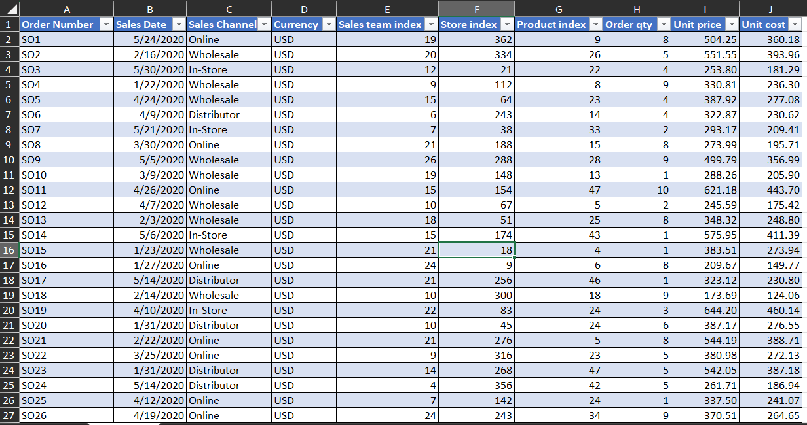  | 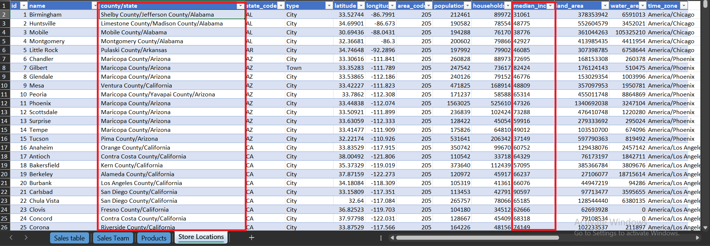

## Skills/Concept Demonstrated
I converted the median income from text to number.

Using the TEXTAFTER function of excel - I extracted the state values from the county/state column to have my state data separated from the lot, as this will be needed in the analysis.

Calculations were made for the revenue and expenses to further compute the profit, which is simply the difference between the later and the former. 
- Expenses = order quantity * unit cost
- Revenue = order quantity * unit price
- Profit = Revenue - Expenses

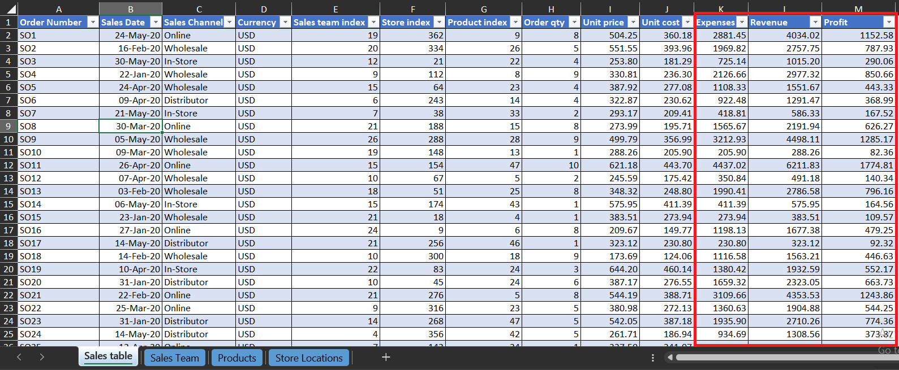

## Modeling
The dataset is contained in different tables, so a connection was required for proper modeling. The star schema database was used to establish the connection among all tables, with the Sales table being the **_fact table_** and the other tables modelled around it as the **_dimension tables_**. 
The modeling format was one which the Sales table was modelled with;
- the sales team table using the _sales team index column_,
- the product table using the _product index column_ and 
- the store location table using the _store index column_.
  
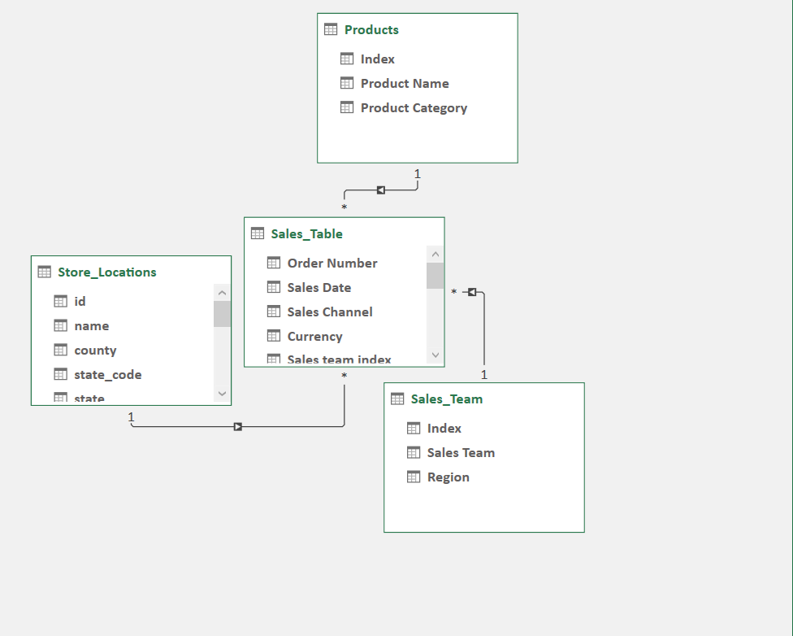

## Data Analysis/Visualization
With the appropriate connections in place and the data modelled, PivotTables for the individual analysis and visuals were created.

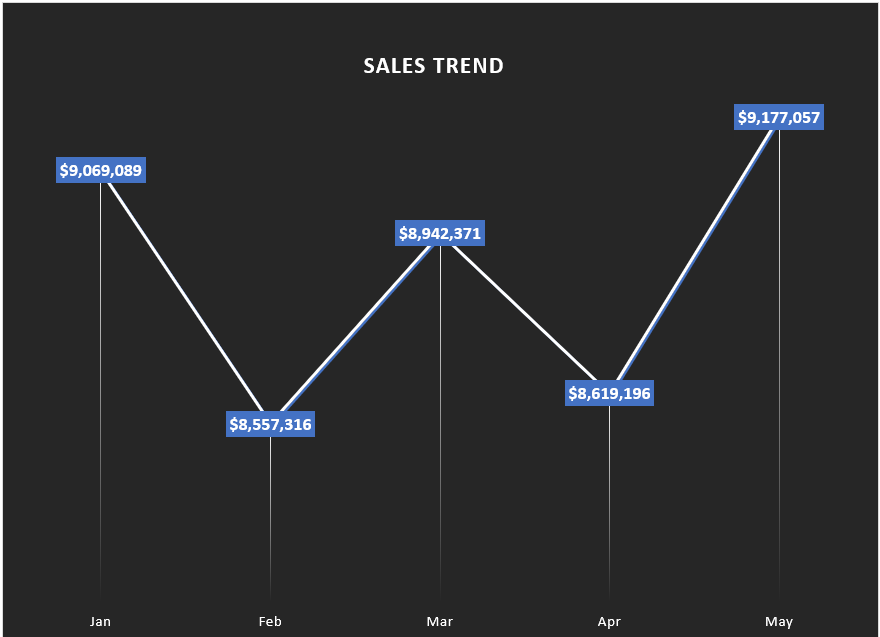

The trend shows the highest sale happened in May, with the least sale being in February. Also, this trend shows a fluctuating form of sales.

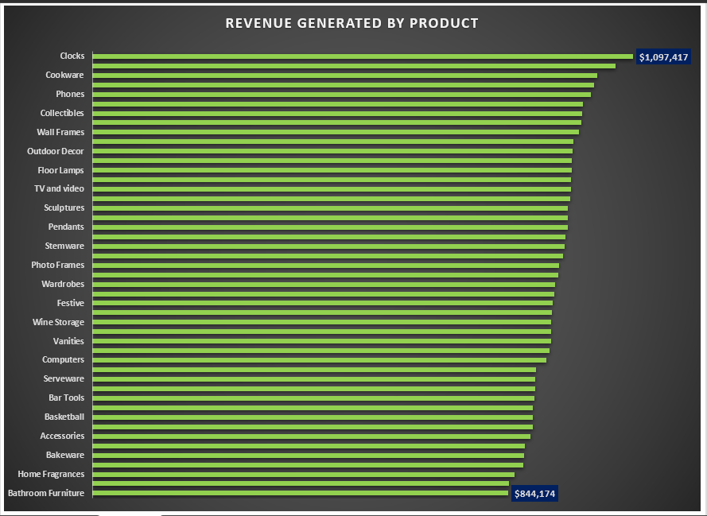

Clock was the highest revenue generating product of all time, while bathroom furniture showed lower purchase. This analysis is evident in the most prevailing home accessory which is clock, as less households would have furniture in their bathrooms compared to more households having clocks.

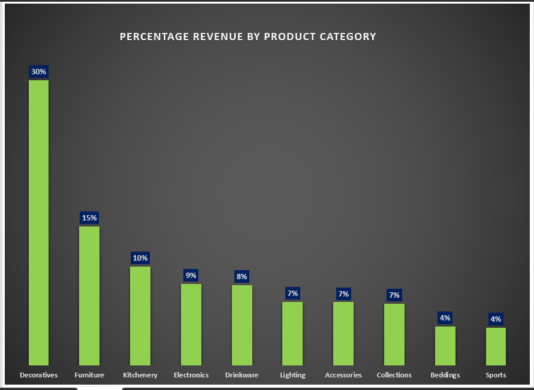

This visual is an indication that decorative items take precedence in customers minds than sporting items or beddings.

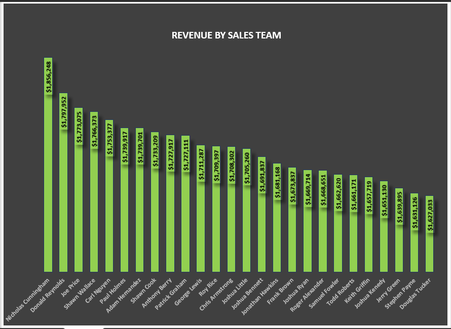

Nicholas Cunningham should be awarded sales rep of the period, for making the highest sale of $1,856,248 that’s 4% of the total revenue generated by the entire 25 sales team.

Top 5 states by revenue       |   Data showing the population and median income of the respective top 5 States
:---------------------------: | :------------------------:
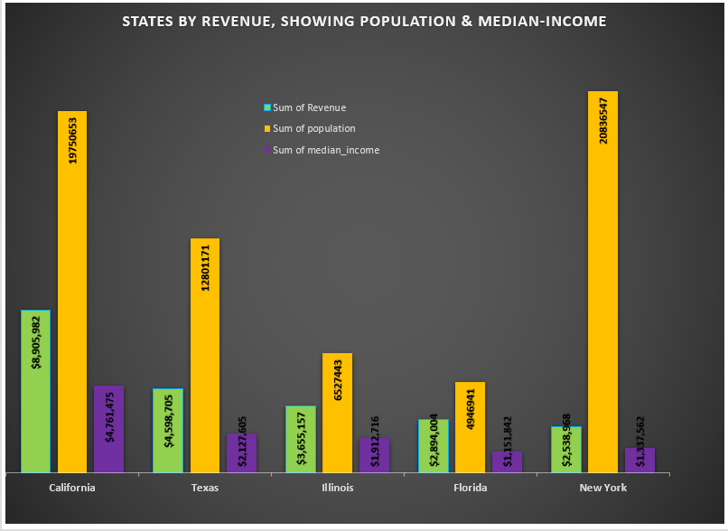    | 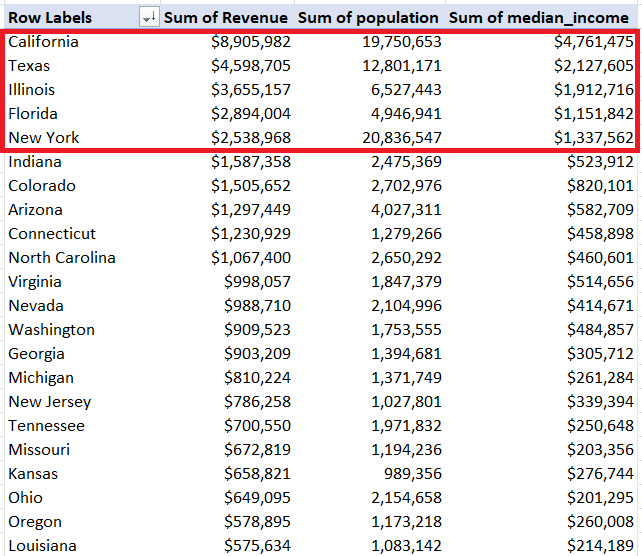

This chart of states by revenue was sliced by state and sorted by the sum of revenue generating states. It can be deduced that the poplulation and median income of a state play a significant role in the product purchase which subsequently increase revenue.
These five states make up 58% of the entire population, with a revenue generation of 51%.

Top 3 and Least 3 States by revenue  |  Population and median income of the 5 lowest States, sorted by sum of revenue
:---------------------------------: |:--------------------------:
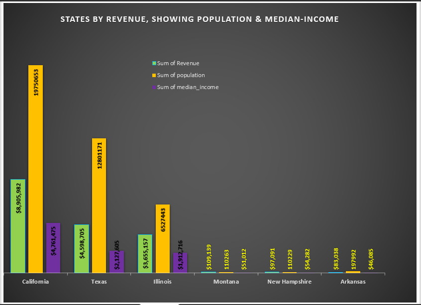    |  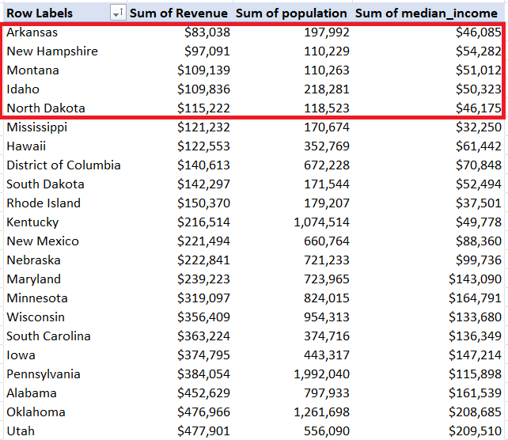

This further buttress the analysis, it is seen that the least revenue generating states are among the least populous states and low in median income.

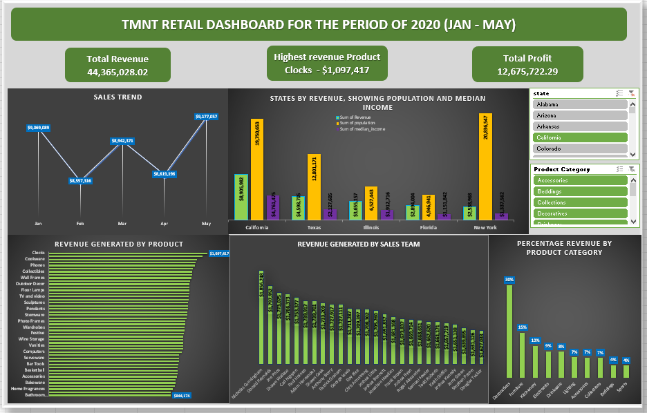

The dashboard of the analysis highlighting the total revenue, highest revenue by product and total profit, with corresponding slicers.
The product by category slicer was required to help scale through the report on how diferent products performed in different states, months, by sales person etc.

## Conclusion and Recommendations
The analysis clearly portrayed the decorative product category as the predominant items preferred by customers, while the clock of the accessories category standout as the most purchased item in all the states.
I will recommend the Sales Director pay more attention on the availability of the above mentioned products in the top highest states which are California, Texas, Illinois, Florida And New York as these five states make up 51% of the entire revenue for the period in view. This does not interpret to not making the rest of the products available in the other states, more attention should just be given to the above mentioned states so they do not run out of products, eventually affecting sales and revenue.

For better insight into the analysis and visualization of this project, click [here](Raw_csv_file.xlsx).
---

I am keen to growth and value creation, hence my penchant for continous and electic learning. I intend to help solve business and world problems as I evolve in this field.  

